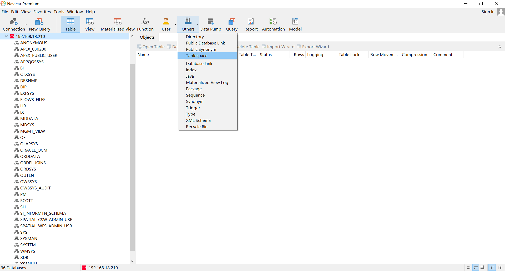
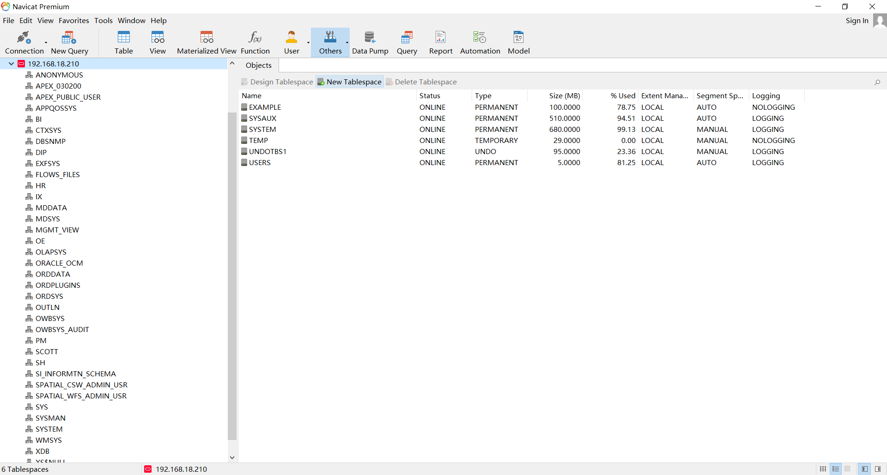
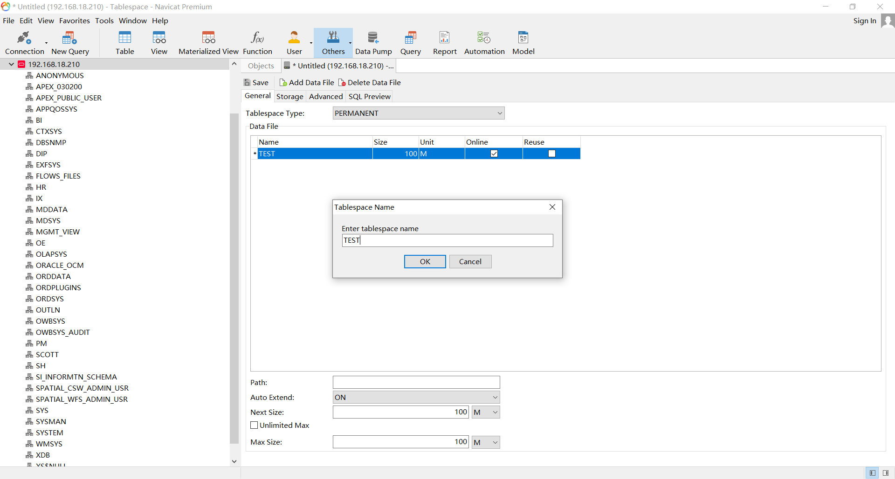
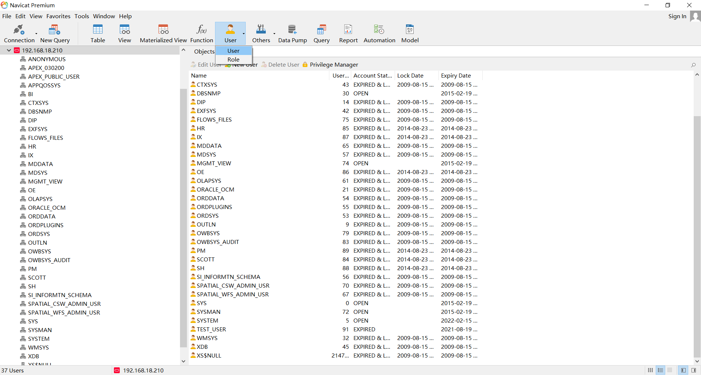
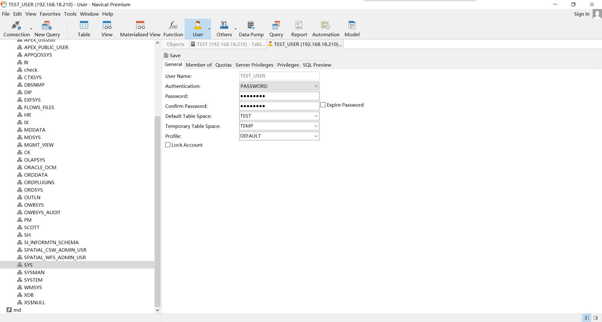
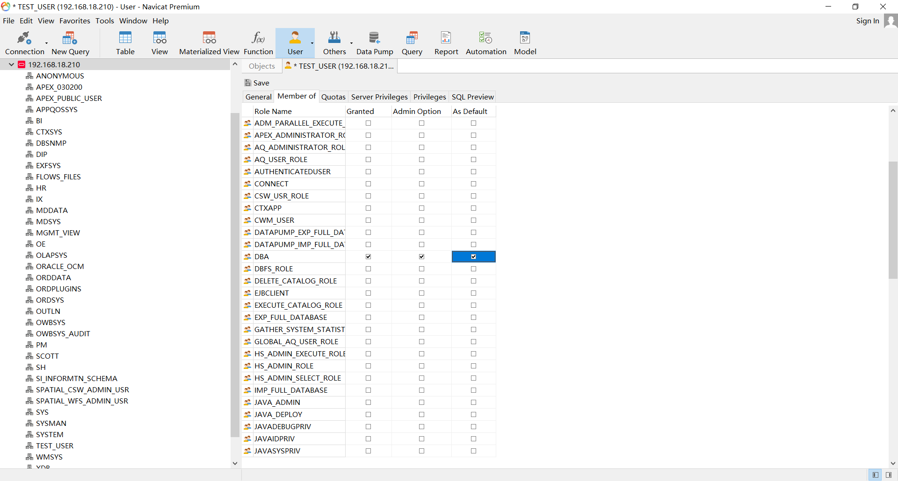
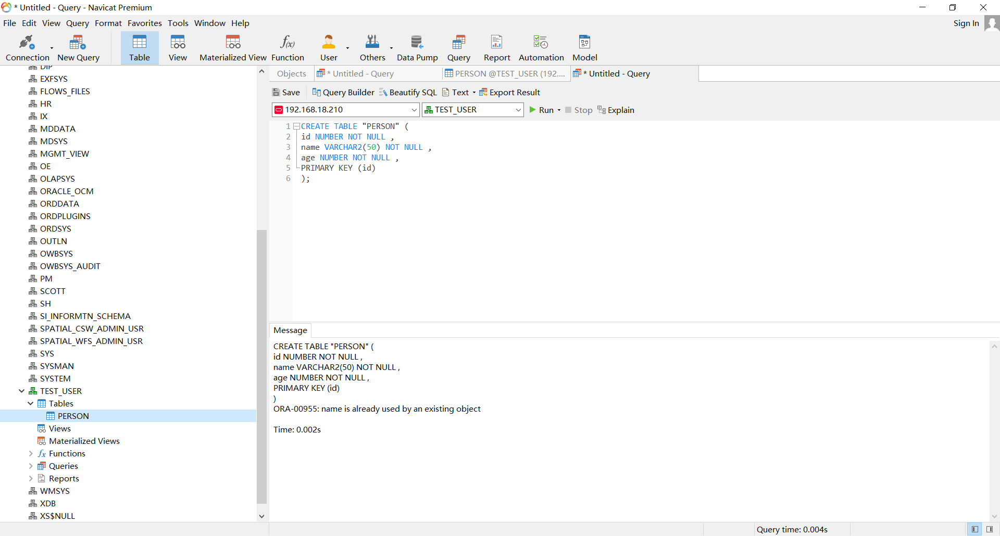

# docker 安装 oracle11g

 [使用docker快速安装oracle](assets\references\使用docker快速安装oracle.html) 

# Navicat创建Oracle数据库

 [Navicat创建Oracle数据库](assets\references\Navicat创建Oracle数据库.html) 

 [springboot-mybatis-oracle学习笔记](assets\references\springboot-mybatis-oracle学习笔记.html) 

## New Tablespace

新建一个名为 `TEST` 的 Tablespace ，其实名字无所谓，后面填写 user 时填对就行了








## New User

1. **Default Table Space** 填上面创建的 `TEST` 

2. 填账号密码时填下面这个

   ```properties
   spring.datasource.username=TEST_USER
   spring.datasource.password=test
   ```





## 授权



## 建表

在 **TEST_USER** 下建表：

```sql
CREATE TABLE "PERSON" (
id NUMBER NOT NULL ,
name VARCHAR2(50) NOT NULL ,
age NUMBER NOT NULL ,
PRIMARY KEY (id)
);
```

建表完毕后刷新可见：



# ojdbc6

## 驱动下载

我下载的时候最新版是 **12.1.0.2** ，官方下载地址如下：

1.  [官方下载地址](https://www.oracle.com/database/technologies/jdbc-upc-downloads.html) 
2.  [Oracle Database 12.1.0.2 JDBC Driver 本地页面](assets\references\Oracle Database 12c Release 1 JDBC Driver Downloads.html) 

## 驱动安装

参考 [maven缺失ojdbc6解决方法](assets\references\maven缺失ojdbc6解决方法.html) ，执行下面的语句，即可安装

```sh
mvn install:install-file -Dfile=ojdbc6.jar -DgroupId=com.oracle -DartifactId=ojdbc6 -Dversion=12.1.0.2 -Dpackaging=jar -DgeneratePom=true
```

# [整合mybatis-plus](assets\references\SpringBoot-Mybatis-plus-master.zip) 

##   [pom.xml](pom.xml) 

这里需要 **ojdbc6** 驱动，前面已经装好了，没装好的需要装一下

```xml
    <dependency>
        <groupId>com.oracle</groupId>
        <artifactId>ojdbc6</artifactId>
        <version>12.1.0.2</version>
        <scope>runtime</scope>
    </dependency>
    <dependency>
        <groupId>com.baomidou</groupId>
        <artifactId>mybatis-plus-boot-starter</artifactId>
        <version>3.4.3.3</version>
    </dependency>
```

##  [application.properties](src\main\resources\application.properties) 

驱动，不废话，这么写就对了

```properties
spring.datasource.driver-class-name=oracle.jdbc.driver.OracleDriver
```

docker 安装 oracle11g 时服务名就是 `helowin` ，懒得改了，就这样吧

```properties
spring.datasource.url=jdbc:oracle:thin:@127.0.0.1:1521:helowin
```

账号密码，不废话了

```properties
spring.datasource.username=TEST_USER
spring.datasource.password=test
```

##  [Person.java](src\main\java\com\example\oraclemybaitsplus\entity\Person.java) 

之前我用 `USER` 做表名，结果报错了：

```
### Error updating database.  Cause: java.sql.SQLSyntaxErrorException: ORA-00903: 表名无效
```

这是因为 `USER` 是保留字，如果不小心用了 `USER` 这个单词就只能加上双引号，变成 `"USER"`  。我不知道 mybatis 怎么让表名加上双引号，所以我直接避开它，使用表名 `PERSON` 

##  [PersonMapper.java](src\main\java\com\example\oraclemybaitsplus\mapper\PersonMapper.java) 

别忘了加 `@Mapper` 注解

##   [Tests.java](src\test\java\com\example\oraclemybaitsplus\Tests.java) 

测试类，直接运行，不出意外，可插入数据


